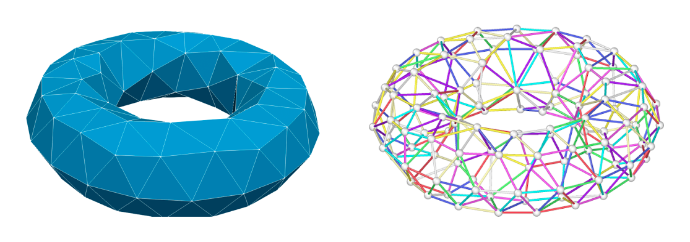
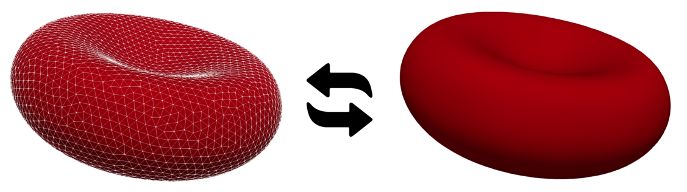

# mesh2lammps
Mesh2Lammps is an open-source software to convert triangular unstructured meshes to course-grained LAMMPS molecular input files.

# Installation
You can perform a minimal install of gym with:

```
git clone https://github.com/mehdiataei/mesh2lammps
cd mesh2lammps
python3 setup.py install 

```
If you prefer, you can do a minimal install of the packaged version directly from PyPI:

```
pip install mesh2lammps 

```
## Run an example

First, close the repository using the following git command:

```
$ git clone https://github.com/mehdiataei/LBfoam.git
```


Compile the `bucket2D` example:
```
$ cd examples/lbfoam/bucket2D
$ make
```

(Note: To compile the software on MacOS, uncomment the ` -DPLB_MAC_OS_X` compilation flag in the Makefile).

Run the example using the following command:

```
$ ./bucket2D bucket2D.xml
```

To run the example in parallel using 8 cores for example:

```
$ ./mpirun -np 8 bucket2D bucket2D.xml
```



## Getting help and bug report

Please submit an issue if you found a bug in the program or needed help with the software.